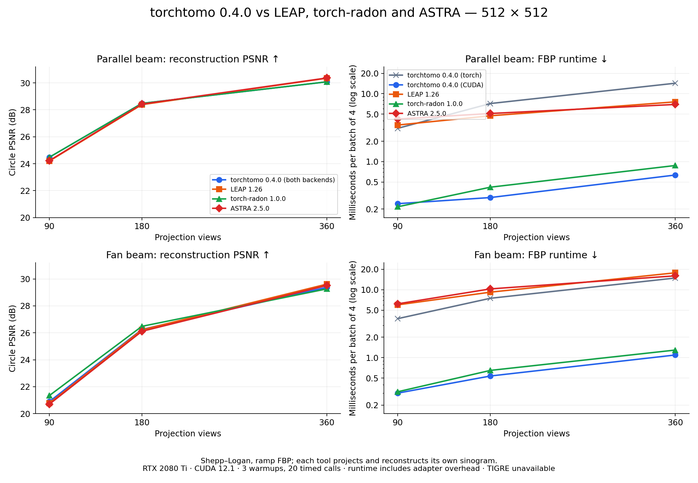

# TorchTomo Benchmarks

**CT projector comparisons, reconstruction experiments, and differentiable geometry calibration — with recorded results and reproducible scripts.**

[](https://github.com/itu-biai/torchtomo)
[](https://pytorch.org/)
[](libraries/results/0.4.0/README.md)

How does [TorchTomo](https://github.com/itu-biai/torchtomo) compare with other CT
projectors? How do analytical, iterative, and learned reconstruction methods
behave on the same measurements? What can geometry gradients recover from
measured scans? This repository contains the experiments, adapters, and
versioned measurements used to answer those questions.

[Results](#recorded-results) · [Setup](#setup) · [Run experiments](#run-experiments) ·
[Methods](#reconstruction-methods) · [Protocol](#evaluation-and-reproducibility) ·
[Historical runs](#historical-training-runs)



*512 × 512 Shepp–Logan phantom; parallel- and fan-beam reconstruction quality and
FBP runtime on an RTX 2080 Ti. Each library reconstructs its own sinogram.
[Measurement settings and raw results](libraries/results/0.4.0/README.md).*

## What is in this repository?

| Experiment | What it measures | Guide |
| --- | --- | --- |
| **Library comparisons** | Operator agreement, FBP quality, runtime, and GPU-memory observations for TorchTomo, LEAP, torch-radon, ASTRA, TIGRE, and scikit-image, where supported | [`libraries/`](libraries/README.md) |
| **Reconstruction methods** | Ten analytical, iterative, supervised, and self-supervised methods plus validation-tuned FBP on ellipse phantoms or CT slices | [`training/`](training/README.md) |
| **Geometry calibration** | Centre of rotation on HTC 2022 and FIPS walnut scans; per-view motion and angle errors; classical calibration baselines | [`geometry/`](geometry/README.md) |
| **Research tables and figures** | Repeated geometry-gradient timings, adjoint diagnostics, paired statistics, and exported tables and figures | [`isbi/`](isbi), [recorded tables](isbi/results/tables/final_tables.md) |
| **Tests** | Cross-library operator consistency and checks on training, metrics, and experiment code | [`tests/`](tests) |

TorchTomo’s own speed, adjoint, and synthetic geometry checks live in the
[library repository](https://github.com/itu-biai/torchtomo/tree/main/benchmark).
This companion repository holds experiments that need additional dependencies.

## Recorded results

Start with the **[0.4.0 results and methodology](libraries/results/0.4.0/README.md)**.
The release is pinned in `requirements.txt`; its recorded library measurements
use PyTorch 2.4.0+cu121 and an NVIDIA GeForce RTX 2080 Ti.

For 512 × 512 images, batch 4, 360 views, the recorded mean **FBP runtime** is:

| Geometry | TorchTomo PyTorch | TorchTomo CUDA | LEAP | torch-radon | ASTRA |
| --- | ---: | ---: | ---: | ---: | ---: |
| Parallel beam | 14.292 ms | 0.635 ms | 7.598 ms | 0.878 ms | 6.957 ms |
| Fan beam | 14.891 ms | 1.095 ms | 17.779 ms | 1.295 ms | 16.037 ms |

Three warmups, 20 timed calls; runtime includes adapter overhead. These timings
apply to that setup. TIGRE was unavailable in this 0.4.0 measurement environment.

| Artifact | Contents |
| --- | --- |
| [Parallel-beam results](libraries/results/0.4.0/parallel/library-comparison.json) | Raw settings, quality, runtime, memory observations, and software provenance |
| [Fan-beam results](libraries/results/0.4.0/fan/library-comparison.json) | The same measurements for flat-detector fan beam |
| [0.4.0 summary](libraries/results/0.4.0/README.md#real-ct-validation-tuned-fbp) | Validation-selected FBP filters evaluated on held-out real CT slices |
| [Geometry results](geometry/README.md) | Measured-scan calibration and controlled motion/angle-error experiments |
| [Repeated-seed training smoke runs](training/smoke-0.4.0-summary.json) | Execution and bookkeeping checks at 32 × 32 for two epochs |
| [Historical training results](training/README.md) | Full earlier runs, with their version and protocol context |

The 0.4.0 smoke runs check execution and checkpoint handling; they do not establish
convergence or a learned-method ranking. Earlier full training runs retain their
original versions and are not relabeled as 0.4.0 measurements.

## Setup

Use **Python 3.10+**. Install a PyTorch build appropriate for your device, then:

```bash
git clone https://github.com/itu-biai/torchtomo-benchmark.git
cd torchtomo-benchmark
python -m venv .venv
source .venv/bin/activate
python -m pip install -r requirements.txt
make test
```

The requirements install `torchtomo==0.4.0`, Matplotlib, NumPy, pytest, Ruff,
scikit-image, SciPy, and algotom. To work against a matching local TorchTomo
checkout, install it after the requirements:

```bash
python -m pip install -e ../torchtomo
```

**Optional comparison libraries:** LEAP, torch-radon, ASTRA, and TIGRE have
separate installation and compatibility steps in
[`libraries/README.md`](libraries/README.md). Comparison scripts and tests skip
unavailable optional libraries. The geometry-gradient comparison with Thies
et al. additionally requires their source repository and `numba-cuda`.

CPU is enough for the small phantom training example below. CUDA is required for
many external-projector comparisons and the recorded GPU timings; large training
runs are intended for a GPU. Geometry scripts fetch measured scans from Zenodo
into `geometry/data/` on first use.

## Run experiments

Run commands from the repository root with the virtual environment activated.
Use a fresh output directory for new measurements to preserve recorded runs.

### Start with a small reconstruction experiment

Train FBP + U-Net and Learned Primal-Dual on 64 × 64 ellipse phantoms:

```bash
python training/train.py \
    --device cpu --image-size 64 --angles 90 \
    --models fbp-unet,lpd --skip-classical \
    --unet-epochs 2 --lpd-epochs 2 \
    --output training/local-smoke
```

This short run checks the pipeline. Increase the training schedule for a
convergence experiment. Output includes configuration, metrics, training logs,
figures, and checkpoints.

### Compare CT libraries

```bash
# Operator times for installed libraries and TorchTomo backends
python libraries/speed_table.py

# Reconstruction quality and figures, in separate output directories
python libraries/compare_libraries.py --geometry parallel \
    --sections quality figure --output libraries/local-parallel
python libraries/compare_libraries.py --geometry fan \
    --sections quality figure --output libraries/local-fan
```

Add `performance` to `--sections` to measure runtime and memory on an idle GPU.
The [library guide](libraries/README.md) explains geometry conventions, physical
scaling, adapters, and each comparison’s scope.

### Train the full reconstruction benchmark

```bash
python training/train.py \
    --device cuda --backend cuda --image-size 512 --angles 90 --batch-size 5 \
    --photons 100000 --seed 2026 --training-seed 2026 \
    --output training/local-512-parallel
```

Use `--geometry fan` for fan beam, `--projector leap` for LEAP, or `--data-dir`
with packed CT slices for real-data experiments. Every configuration should have
its own output directory. See [`training/README.md`](training/README.md) for CT
packing, model selection, repeated seeds, and evaluation details.

Resume or evaluate a compatible saved run with:

```bash
python training/train.py --resume --output training/local-512-parallel
python training/train.py --evaluate-only --output training/local-512-parallel
```

### Calibrate scan geometry

```bash
make calibrate  # Measured-scan centre of rotation and before/after figures
make motion     # Controlled per-view shifts and angle errors
```

These targets write to `geometry/results/`. See the
[geometry guide](geometry/README.md) for data sources, settings, baseline
assumptions, and interpretation.

## Reconstruction methods

| Family | Methods |
| --- | --- |
| Analytical | Ramp FBP; separately validation-tuned FBP |
| Iterative | SIRT; SART |
| Denoising and regularization | FBP + BM3D; Regularization by Denoising (RED) |
| Supervised | FBP + U-Net; iRadonMAP; Learned Primal-Dual |
| Self-supervised | Noise2Inverse; Proj2Proj |

`--models` chooses trained networks; `--classical-methods` chooses classical
methods. Noise2Inverse and Proj2Proj use measurement-only losses and checkpoint
selection. The BM3D implementation is included in PyTorch. See the
[training guide](training/README.md) for architecture and selection details.

## Evaluation and reproducibility

- **Match data and dose.** New runs use 100,000 photons per ray. Hold `--photons`, `--seed`, geometry, data, and schedule fixed when comparing backends. `--calibrate-dose` reproduces the older backend-dependent dose protocol.
- **Select on validation, score on test.** The additional FBP baseline chooses its filter on validation only. Real CT splits keep patient groups disjoint. TorchTomo and LEAP search different named filter families.
- **Read the metric definition.** Current library PSNR uses the visible circle; SSIM averages valid 7 × 7 window centres inside it. Historical metrics may use a different region. Real CT also reports display-window metrics.
- **Separate sources of variability.** Vary `--training-seed` with fixed data/noise and use `training/summarize_repeats.py` for variation across training runs. Slice variation and training-seed variation describe different uncertainty.
- **Keep provenance.** Current configurations and JSON record software versions, source hashes, settings, and seeds. Git stores recorded configurations, metrics, logs, tables, and figures; checkpoints, packed datasets, and reconstruction tensors stay outside Git.
- **Interpret memory within its scope.** PyTorch allocation counters miss external-library allocations; driver before/after deltas miss temporary buffers. The 0.4.0 memory panels cover TorchTomo, and these counters do not establish a total-memory ranking across libraries.

The full [0.4.0 methodology](libraries/results/0.4.0/README.md) and
[training protocol](training/README.md#current-protocol-torchtomo-040) explain
what is comparable across recorded runs.

## Historical training runs

These directories are under `training/`. Except for the first, the ellipse runs
use 512 × 512 images and 90 views. Version and protocol context, tables, and
figures are documented in [`training/README.md`](training/README.md).

<details>
<summary>Browse the earlier full training runs</summary>

| Directory | Data | Geometry | Projector | Methods |
| --- | --- | --- | --- | --- |
| `results` | Ellipses, 64 × 64, CPU | Parallel | TorchTomo | All ten |
| `results-512` | Ellipses | Parallel | TorchTomo | FBP, U-Net, LPD with 5 iterations |
| `results-512-lpd10` | Ellipses | Parallel | TorchTomo | FBP, U-Net, LPD with 10 iterations and width 32 |
| `results-512-all` | Ellipses | Parallel | TorchTomo | All ten |
| `results-512-all-leap` | Ellipses | Parallel | LEAP | All ten |
| `results-512-cuda` | Ellipses | Parallel | TorchTomo CUDA | All ten |
| `results-512-fan` | Ellipses | Fan | TorchTomo | All ten |
| `results-512-fan-cuda` | Ellipses | Fan | TorchTomo CUDA | All ten |
| `results-512-fan-leap` | Ellipses | Fan | LEAP | All ten |
| `results-ctw-six-methods` | CT slices | Parallel | TorchTomo | FBP, SIRT, SART, U-Net, RED, LPD |
| `results-ctw` | CT slices | Parallel | TorchTomo | All ten |
| `results-ctw-leap` | CT slices | Parallel | LEAP | All ten |
| `results-ctw-cuda` | CT slices | Parallel | TorchTomo CUDA | All ten |
| `results-ctw-fan` | CT slices | Fan | TorchTomo | All ten |
| `results-ctw-fan-cuda` | CT slices | Fan | TorchTomo CUDA | All ten |
| `results-ctw-fan-leap` | CT slices | Fan | LEAP | All ten |

</details>

## Development and attribution

```bash
make test
make lint
python training/train.py --help
make help
```

For an issue or a new result, include the command, dependency versions, hardware,
geometry, seeds, and output configuration. Report problems through
[GitHub issues](https://github.com/itu-biai/torchtomo-benchmark/issues).

Developed alongside TorchTomo by **BIAI Lab**. When referencing results, link the
specific result file and record its commit, settings, and software versions.
TorchTomo’s license is documented in the
[library repository](https://github.com/itu-biai/torchtomo/blob/main/LICENSE);
external libraries and datasets retain their own terms.

The original experiment code moved from TorchTomo at commit `b349f5c`, from
`examples/ellipses/`, `benchmark/`, and `benchmark-results/`. Earlier history
remains in the [TorchTomo repository](https://github.com/itu-biai/torchtomo).
