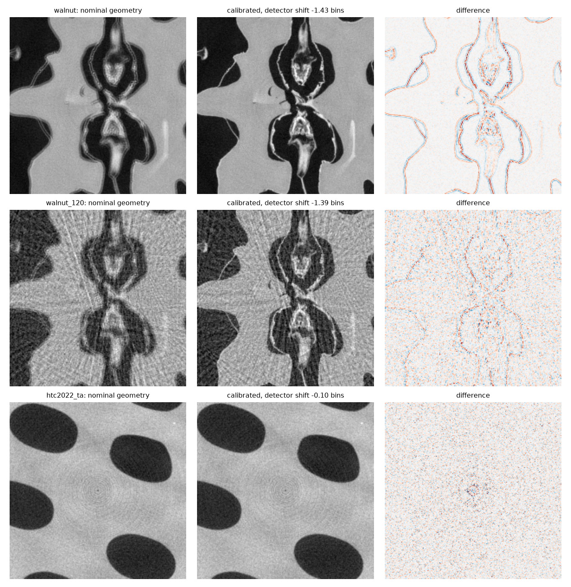

# Geometry

What differentiating the scan geometry buys, measured: the centre of rotation of
measured scans against the classical methods, and per-view motion and angle
errors against projection matching. The cost of the geometry gradient itself,
against Thies et al.'s differentiable backprojector, is
[`libraries/compare_geometry_gradients.py`](../libraries/compare_geometry_gradients.py).

These need torchtomo's pose table (`projector.pose`, `learnable_geometry`), which
is on torchtomo's `main` and not released yet, so install torchtomo from a
checkout.

| File | What it does |
| --- | --- |
| `datasets.py` | HTC 2022 and the FIPS walnut in torchtomo's units, fetched from Zenodo into `data/` on first use |
| `cor.py` | centre-of-rotation estimators: the gradient of the data consistency, a grid over it, Vo's method, phase correlation |
| `calibrate_real.py` | every estimator on seven measured scans, with an injection test; writes `results/cor.json` |
| `figures.py` | FBP before and after calibration, `results/fbp_before_after.png` |
| `correct_motion.py` | per-view shifts and angles against projection matching; writes `results/motion.json` |

```bash
make calibrate   # about 3 minutes on an RTX 2080 Ti, plus the first download
make motion      # about 6 minutes
```

Every recorded number below comes from those two targets on an RTX 2080 Ti.
The FBPs themselves (`results/*.npz`) stay out of git.

## Centre of rotation on measured scans

The objective is the reconstruction's own data consistency,
`|| A_u fbp_u(y) - y ||^2`, on a 256 px grid, with `u` the lateral detector shift
("detector" model) or the source and detector shifted together ("axis" model).
The gradient estimate is L-BFGS on that one scalar; the grid is a 1 bin grid
refined at 0.02 bins; Vo's method and phase correlation are algotom's.

| Scan | Views | Gradient, detector | Grid | Gradient, axis | Vo |
| --- | --- | --- | --- | --- | --- |
| HTC 2022 solid disc | 721 | -0.106 | -0.10 | -0.078 | -0.25 |
| HTC 2022 ta | 721 | -0.096 | -0.10 | -0.071 | +0.00 |
| HTC 2022 tb | 721 | -0.206 | -0.20 | -0.152 | -0.25 |
| HTC 2022 tc | 721 | -0.122 | -0.12 | -0.090 | -0.25 |
| HTC 2022 td | 721 | -0.197 | -0.20 | -0.145 | -0.25 |
| walnut | 1200 | -1.426 | -1.42 | -0.518 | -1.50 |
| walnut | 120 | -1.393 | -1.40 | -0.507 | -2.25 |

In detector bins of 0.2 mm. The HTC scans are within 0.21 bins of centre; the
raw walnut sinogram is 1.43 bins, 0.29 mm at the detector, off. The axis model's
estimate is the detector model's divided by the magnification (2.73 for the
walnut, 1.35 for HTC), so at these fan angles the two are nearly the same model.

Nothing measured has a known offset, so the check with a ground truth slides each
measured sinogram by a known `d` of -5.3, -2.6, 2.6 and 5.3 bins, which is
exactly the sinogram a detector moved by `d` would have recorded, and asks every
method to move its estimate by `d`. The worst error over the four:

| Scan | Gradient | Grid | Vo | Phase correlation |
| --- | --- | --- | --- | --- |
| HTC 2022, worst of five | 0.013 | 0.02 | 0.20 | fails, up to 44 |
| walnut, 1200 views | 0.014 | 0.02 | 0.20 | fails, up to 85 |
| walnut, 120 views | 0.032 | 0.04 | 0.20 | fails, up to 213 |

The grid is limited by its 0.02 bin step and Vo by its 0.25. Phase correlation
registers the 0 and 180 degree projections, which are mirror images only in
parallel beam, so on these fan-beam scans it is outside its assumptions rather
than a fair competitor. The gradient takes 0.09 to 0.23 s per scan in under 200
MiB, the grid 0.23 to 0.69 s. Before torchtomo#5 put the FBP backprojection's
geometry gradient on the CUDA kernels, the gradient took 0.6 to 4 s and up to
7.6 GB, and the grid was the faster of the two.



With the nominal geometry every edge of the walnut is doubled; calibrated, the
edges are single and the thin membranes appear, from 1200 views and from 120. The
HTC scan does not change, as a centred scan should not.

Two things matter for reproducing these. Both datasets need the detector flipped
(`flip_detector=True`): the data consistency is 13 to 40 times lower than in any
other orientation. And Adam with 60 steps is not enough to move the estimate 5
bins: its injection errors were 0.2 bins, which is why the estimate is L-BFGS.

## Per-view motion and angle errors

Parallel beam, 256 px, 256 views. Each view is displaced by a smooth drift of up
to 4 px plus 0.5 px of jitter and, in the second scenario, its angle is also off
by 0.3 degrees (standard deviation). 1% noise. Six phantoms (Shepp-Logan and the
HTC organisers' five reconstructions) and three seeds each; the means:

| Scenario | Method | Shift RMSE | Angle RMSE | PSNR | Time |
| --- | --- | --- | --- | --- | --- |
| shifts | none | 1.573 px | | 19.14 dB | |
| shifts | projection matching | 0.037 px | | 25.78 dB | 0.1 s |
| shifts | gradient, shifts | 0.030 px | | 25.81 dB | 0.5 s |
| shifts | oracle | 0 | | 25.83 dB | |
| shifts and angles | none | 1.573 px | 0.303 deg | 19.14 dB | |
| shifts and angles | projection matching | 0.041 px | 0.303 deg | 25.56 dB | 0.1 s |
| shifts and angles | gradient, shifts | 0.038 px | 0.303 deg | 25.58 dB | 0.5 s |
| shifts and angles | gradient, shifts and angles | 0.033 px | 0.158 deg | 25.61 dB | 0.7 s |
| shifts and angles | oracle | 0 | 0 | 25.66 dB | |

Errors leave out what no method can see from the sinogram: a rigid translation of
the object and a constant angle offset. Projection matching (reconstruct,
reproject, register each view by cross-correlation, 100 rounds) is five times
faster and models shifts only; the gradient takes the angles too and halves their
error, the one thing here matching cannot do. Angles are only halved because a
consistent set of wrong angles still reprojects consistently.

The gradient estimate is L-BFGS over every view's shift (and angle) at once,
coarse to fine against sinograms blurred along the detector by 4, 2, 1 and 0
bins. Each of these was needed: PyTorch's default L-BFGS tolerance stops before
the first step on low-contrast phantoms; without coarse to fine, noise leaves it
in a local minimum above the one projection matching finds; and a smoothness
penalty on the shifts biased them to 0.1 to 0.2 px.
