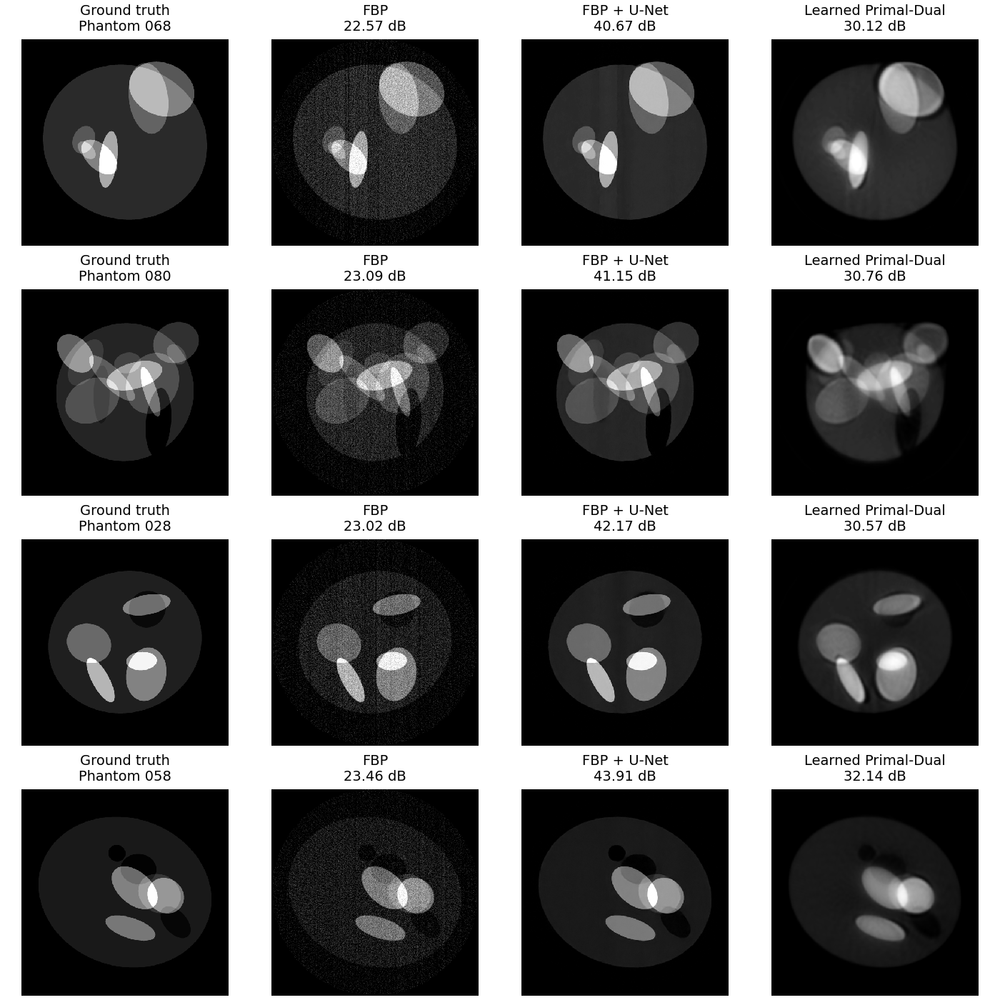
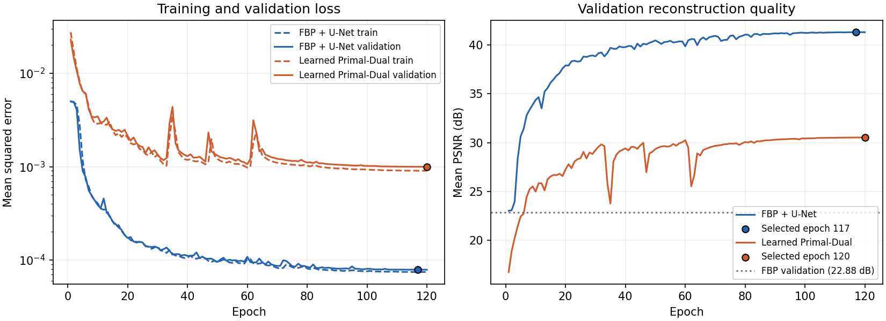
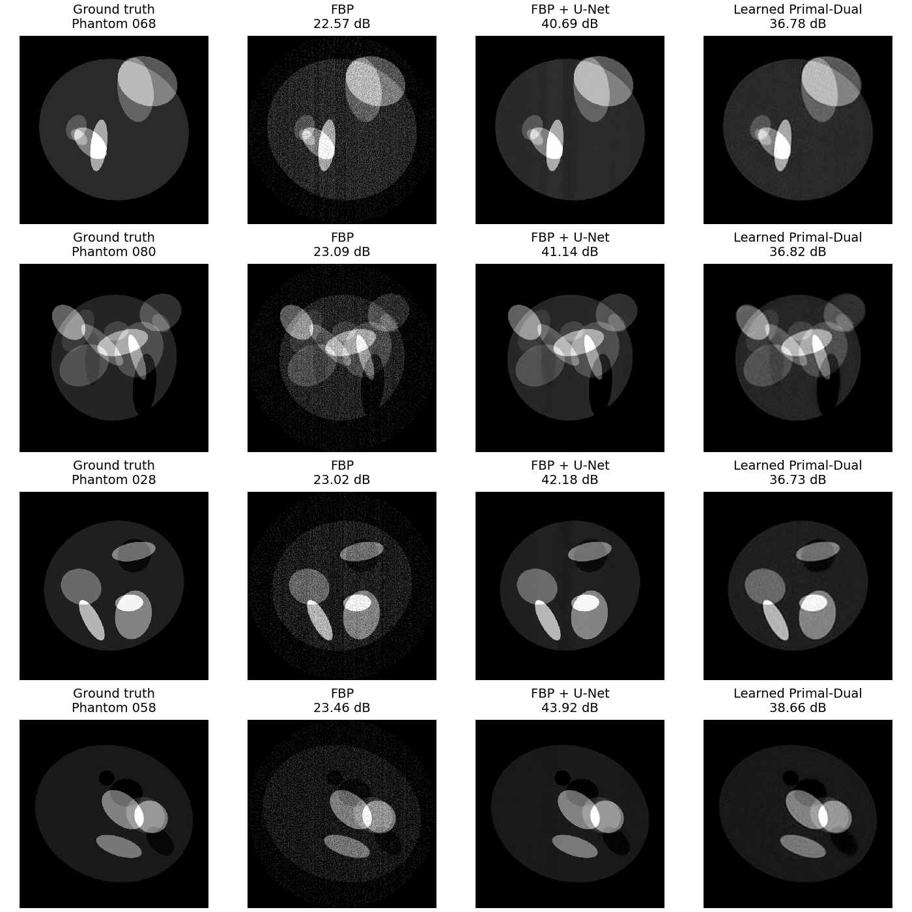
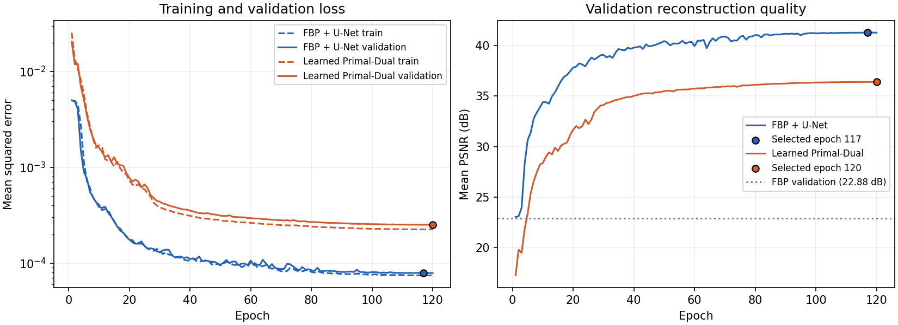
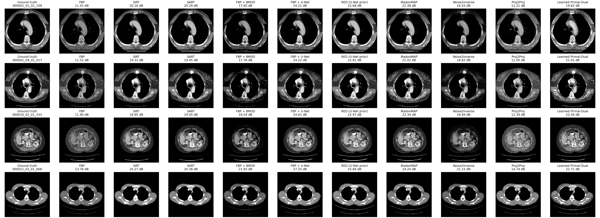
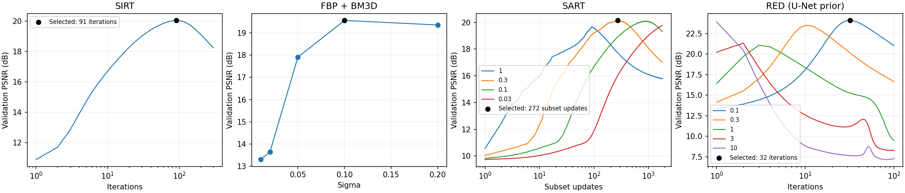
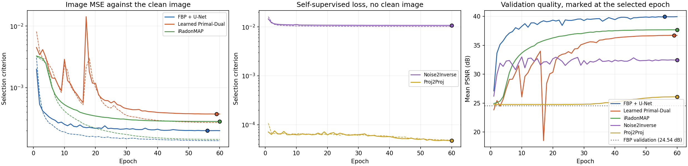
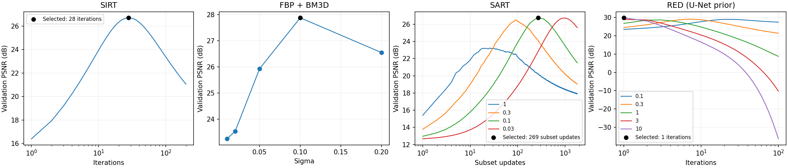
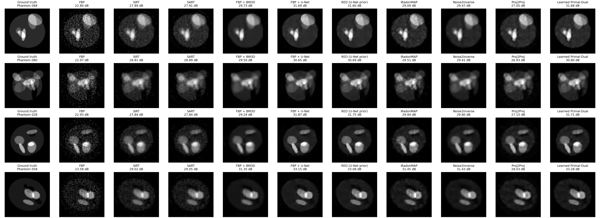
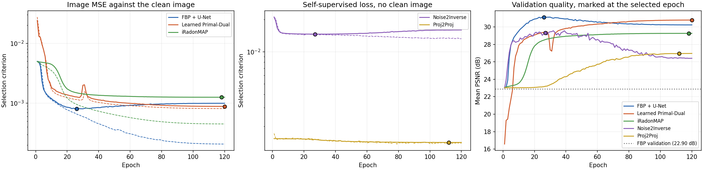

# Reconstruction methods on torchtomo

Generate 100 different ellipse phantoms, or load real CT slices with `--data-dir`,
split them into training, validation, and test images, and compare:

- **FBP:** ramp-filtered backprojection, plus a separately validation-tuned filter baseline.
- **SIRT** and **SART:** the classical algebraic methods, driven by TorchTomo's exact
  discrete adjoint and stopped early.
- **FBP + BM3D:** collaborative filtering of the FBP image, implemented here in pure
  PyTorch so it adds no dependency.
- **FBP + U-Net:** a residual U-Net trained on the noisy FBP images.
- **RED:** Regularization by Denoising, reusing the trained U-Net as its denoiser.
- **iRadonMAP:** a learnable filtering layer and back-projection layer that start at
  the analytic reconstruction, then a refinement network.
- **Noise2Inverse** and **Proj2Proj:** self-supervised, trained from the measurements
  alone with no clean image anywhere in their loss or their checkpoint selection.
- **Learned Primal-Dual:** an unrolled network trained directly on the same noisy
  sinograms, using TorchTomo's matched `forward()` / `backward()` pair.

`--models` picks which networks to train, and `--skip-classical` drops FBP's untrained
companions, so a quick run need not pay for all ten.

It needs only torchtomo, PyTorch, and Matplotlib, and no experiment tracking
service. Python `logging` writes progress to the console and
`results/training.log`.

## Current protocol: torchtomo 0.4.0

New runs default to **100,000 photons per ray** and write to `results-0.4.0/`.
Use the same `--photons`, `--seed`, data, geometry and schedule for backend comparisons.
`--calibrate-dose --target-psnr 23` reproduces the older FBP-quality dose protocol;
that changes dose with the backend and should not be used to isolate operator effects.

Alongside ramp FBP, **FBP (validation-tuned)** searches ramp, Shepp-Logan, cosine,
Hamming and Hann on validation only. LEAP searches its native orders 12, 0 and 2.
The two backends' candidate filters are different families, recorded by name.
Networks and BM3D keep their ramp inputs; the tuned analytic baseline is scored as
`fbp-tuned`. Proj2Proj uses reflection at boundaries to remove target leakage,
and its validation masks cover every row and column phase.

`--seed` fixes the images, split and Poisson realization. Vary `--training-seed`
to measure model variability while keeping those data fixed, for example:

```bash
for training_seed in 2026 2027 2028; do
    python training/train.py --device cuda --backend cuda --image-size 512 \
        --photons 100000 --seed 2026 --training-seed "$training_seed" \
        --output "training/results-512-0.4.0-seed-$training_seed"
done
python training/summarize_repeats.py training/results-512-0.4.0-seed-*
```

Compare means and standard deviations **across training runs**, rather than using
slice-to-slice variation as training uncertainty. CT slices from one patient are
correlated; patient-level resampling is needed for uncertainty over patients.
Configurations record the release, source hashes, image/window fingerprints, dose
protocol and training seed. Each method's `seconds_scope` states whether its time
covers inference, training, or validation search; these are different workloads.
To run the filter search alone on the packed CT slices:

```bash
python training/train.py --device cuda --backend cuda --image-size 512 \
    --data-dir training/ct-subset --models "" --classical-methods fbp-tuned \
    --output training/results-ct-fbp-0.4.0-torchtomo-parallel
```

Historical checkpoints use the previous methodology and must be retrained in a
new directory; resume and evaluate-only reject incompatible saved runs.

## Recorded runs and torchtomo 0.3

Commands in the historical sections describe those original configurations.
The current release, corrected masking and fixed-dose defaults produce new runs;
use a new output directory when running them today.

The tables below under "Recorded 512 x 512 run", "LPD capacity check" and the
real CT section were measured before torchtomo 0.3 changed the FBP ramp filter
(itu-biai/torchtomo fad0119), so FBP and every method that reconstructs through `fbp()` differ from the
current pipeline. Improvements in noiseless FBP do not imply higher noisy FBP PSNR. The directories rerun on
0.3 are `results-512-cuda`, `results-512-fan-cuda`, `results-ctw-cuda` and
`results-ctw-fan-cuda`; on real CT the noiseless FBP reference moves 20.09 to
24.37 dB in window and Proj2Proj 12.73 to 23.41. The comparison against LEAP,
with those numbers, is in
[`libraries/results/README.md`](../libraries/results/README.md).

## Run

From the repository root, with torchtomo installed:

```bash
python training/train.py
```

The default run uses CPU, four threads, and 120 epochs for each network. To change
the run configuration, use a separate output directory:

```bash
python training/train.py \
    --unet-epochs 120 --lpd-epochs 120 --device cpu \
    --output /tmp/torchtomo-ellipses
```

`--device cuda` and `--device mps` are also available when supported by your
PyTorch installation. Phantom generation and Poisson sampling always take place
on CPU with explicit seeds. Training results can vary across devices and versions.

After training, reload the saved dataset and best checkpoints, recompute test
metrics, and regenerate the PNG files without retraining:

```bash
python training/train.py --evaluate-only
```

Use `--help` for image size, angle count, batch size, learning rate, seed,
target FBP PSNR, and model size options. A training run regenerates its output files; use a new
`--output` directory to retain an earlier experiment.

## 512 x 512 run

The default 64 x 64 configuration trains on CPU in minutes. The same script runs at
512 x 512 through its command line options, writing to a separate directory:

```bash
python training/train.py \
    --image-size 512 --angles 90 --batch-size 5 --device cuda \
    --output training/results-512
```

At this size a GPU is effectively required: an A100 needs about 0.03 seconds per
U-Net batch and 0.19 seconds per LPD batch, against roughly 0.5 and 2.3 seconds on
four CPU threads. Phantom generation, noise calibration, and Poisson sampling still
run on CPU with the same seeds, so the dataset does not depend on the training device.

Long runs are interruptible. Every epoch writes `<model>-last.pt` with the optimizer,
scheduler, shuffle stream, and history, so `--resume` continues the same schedule
rather than restarting it. All JSON and checkpoint writes go to a temporary file and
are renamed into place, so an interrupted write cannot truncate an existing file.

`colab_setup.py`, `colab_start.py`, and `colab_status.py` drive a remote GPU session
through the `colab` CLI: the first unpacks two uploaded archives, torchtomo as
`/content/torchtomo-source.tar.gz` and this repository as
`/content/torchtomo-benchmark.tar.gz` (`git archive -o <name> HEAD` in each), and
runs both test suites and the timing profile, the second starts training detached and records its PID, and the
third reports progress without holding the kernel open.

### Recorded 512 x 512 run

Trained on a Colab A100 with PyTorch 2.11.0, 120 epochs per network, and the same
seed. Calibration selected **65,820 incident photons per ray**, giving 22.96 dB
training FBP and 22.88 dB validation FBP. Test-set results:

| Method | Test PSNR, mean ± population std | Test MSE | Selected epoch | Training time |
| --- | ---: | ---: | ---: | ---: |
| FBP | 23.00 ± 0.35 dB | 0.0050248 | n/a | n/a |
| FBP + U-Net | 41.70 ± 1.10 dB | 0.0000699 | 117 | 49 s |
| Learned Primal-Dual | 30.86 ± 1.73 dB | 0.0008922 | 120 | 333 s |

This run and the capacity check below predate every method added since, so their
tables cover FBP and the two networks only.

The two networks rank differently here than at 64 x 64, where they finished within
0.11 dB of each other. Neither overfits at this resolution: training and validation
loss track each other to the last epoch for both models.

The change is the U-Net improving, not LPD degrading. Between the two resolutions LPD
moves from 31.36 to 30.86 dB while the U-Net moves from 31.48 to 41.70 dB. At 64 x 64
the U-Net lands 2 dB below the 33.54 dB reconstruction that FBP gives from noiseless
data; at 512 x 512 it lands 9.5 dB above the corresponding 32.20 dB figure. Detector
noise is independent per sample while the phantom features are eight times wider in
pixels, so post-processing has far more redundancy to average over, and every image
comes from one narrow generator that a residual network can learn to snap to.

LPD is also the smaller model here, 77,690 parameters against 118,305, and it starts
from a zero image rather than from an FBP and runs five iterations rather than the ten
of Adler and Oktem. Its dual updates reach about 15 detector samples after five
three-layer blocks. Truncating a Ram-Lak kernel to that support costs 0.3% in total
energy at both sizes, but the error concentrates at the lowest frequencies: 11%
relative error in the lowest bin of a 64 sample detector row against 238% in the
lowest bin of a 512 sample one. The large-scale part of the filtering is what fails to
carry over. The capacity check below measures how much of the gap that accounts for.




### LPD capacity check

Same dataset, same seeds, same 120 epoch schedule, with LPD rebuilt at ten iterations
and width 32 instead of five and 24:

```bash
python training/train.py \
    --image-size 512 --angles 90 --batch-size 5 --device cuda \
    --lpd-iterations 10 --lpd-width 32 \
    --output training/results-512-lpd10
```

| LPD configuration | Parameters | Test PSNR | Test MSE | Training time |
| --- | ---: | ---: | ---: | ---: |
| 5 iterations, width 24 | 77,690 | 30.86 ± 1.73 dB | 0.0008922 | 333 s |
| 10 iterations, width 32 | 253,220 | 36.95 ± 1.46 dB | 0.0002143 | 730 s |

Doubling the iterations and widening the blocks is worth 6.09 dB, so most of the
original gap was model size rather than the operators. LPD is now the larger of the
two networks, 253,220 parameters against 118,305, and still finishes 4.74 dB behind
the U-Net, which reproduced its 41.69 dB on the same data to within 0.01 dB. Both LPD
runs select their final epoch, so neither has converged on this schedule, and the
capacity run's validation curve is still rising at epoch 120 with none of the spikes
the five iteration run showed.

What remains is the operating point. With 90 angles and roughly 66,000 photons per
ray, FBP keeps enough information that denoising it is close to optimal, and every
phantom comes from one narrow generator, which suits a post-processing network. Testing
the ranking reported for LPD calls for a more ill-posed problem, such as sparse views
or a limited angular range, where FBP carries artifacts that post-processing cannot
undo.

`results-512-lpd10/` keeps only the files that differ from the run above. `gt.png`,
`fbp.png`, `splits.json`, and `phantoms.json` are byte-identical to `results-512/`.




## Real CT slices

The same pipeline runs on real data. `pack_ct_subset.py` reads a dataset laid out as
`train/`, `val/`, and `test/` directories of per-slice `.npz` files and writes one
compact archive per split, keeping the ground truth attenuation image as float16 plus
the display window recovered for each slice:

```bash
python training/pack_ct_subset.py \
    --source /path/to/dataset --output training/ct-subset \
    --train 200 --val 50 --test 50

python training/train.py \
    --data-dir training/ct-subset --photons 100000 \
    --image-size 512 --angles 90 --batch-size 5 --device cuda \
    --lpd-iterations 10 --lpd-width 32 --unet-epochs 60 --lpd-epochs 60 \
    --sirt-iterations 300 --output training/results-ctw
```

The packer takes evenly spaced files from each sorted split, which spreads the subset
across patients without needing a seed, and it refuses to continue if a patient appears
in two splits. Slice names go to `slices.json`.

The stored slices are ground truth only, so measurements are simulated with the same
forward operator and transmission Poisson model. That is required rather than
incidental: Learned Primal-Dual consumes sinograms, so an image-domain noisy copy
cannot drive it, and simulating means all three methods see identical measurements.
Ground truth is masked to the inscribed circle so nothing is scored on content the
geometry cannot see, which costs almost nothing here: 0.06% of the attenuation, the
couch arc.

### Display windows

CT is read inside a narrow window, not across the whole attenuation range, so metrics
and figures both use one. This dataset stores a windowed copy of every slice, and the
window is recovered from the pair by fitting the linear part of

```math
\mathrm{clipped} = \mathrm{clip}\left(\frac{\mathrm{full} - \mathrm{low}}{\mathrm{high} - \mathrm{low}}, 0, 1\right)
```

which reproduces the stored image to within 3e-8. The windows are per slice, not
global. Reading `gt_full` as a linear map of HU with air at 0 and the liver peak near
+60 HU, the two that appear are a soft tissue window at roughly L-18 / W411 and a lung
window at roughly L-521 / W1828, close to the clinical L40 / W400 and L-600 / W1500.

Windowing changes the arithmetic: the soft tissue window spans 0.11 of the attenuation
range, so it magnifies reconstruction error about ninefold. Metrics report the full
image, the visible circle, and the window, and figures render inside the window.

### Recorded run

200 training, 50 validation, and 50 test slices from 138 patients at 512 x 512, 90
angles, 100,000 photons per ray, 60 epochs per network, LPD at ten iterations and
width 32, and `--sirt-iterations 300` for the stopping point search.

| Method | Window PSNR | Circle PSNR | Full image PSNR | Selected on validation |
| --- | ---: | ---: | ---: | ---: |
| FBP | 12.59 ± 1.50 dB | 23.72 dB | 24.79 dB | n/a |
| SIRT | 19.98 ± 1.09 dB | 34.10 dB | 35.17 dB | 91 iterations |
| SART | 20.08 ± 1.09 dB | 34.33 dB | 35.40 dB | 272 updates, relaxation 0.3 |
| FBP + U-Net | 25.46 ± 1.14 dB | 40.00 dB | 41.07 dB | epoch 56 |
| RED (U-Net prior) | 24.14 ± 1.05 dB | 38.30 dB | 39.37 dB | 32 iterations, weight 0.1 |
| Learned Primal-Dual | 23.40 ± 0.92 dB | 37.49 dB | 38.56 dB | epoch 59 |

The window figure is the one to read, and it reorders how large the differences look:
the U-Net gains about 13 dB over FBP there, against roughly 16 dB measured across the
full range.

What FBP gives from **noiseless** data splits the table in two. That reference is
19.73 dB on this test split. It is the dose-free limit of the analytic method: at 512
detector bins, 90 angles is far below
the roughly 800 that Nyquist would ask for, so FBP is capped by angular undersampling
however many photons arrive.

SIRT and SART land just past it, at 19.98 and 20.08 dB, from noisy data. They recover
essentially the entire 7.4 dB the dose costs, and then edge ahead of FBP's analytic
limit because solving the discrete system with a non-negativity constraint copes with
90 views better than a ramp filter, which assumes dense angular sampling. Without a
prior, that is about as far as these measurements go.

Everything carrying a learned prior goes further: the U-Net by 5.7 dB over that
reference, RED by 4.4, LPD by 3.7. Buying that margin is what the prior is for, and it
is why sparse-view CT is the regime where learned reconstruction earns its keep.

Every figure here is measured inside the window over the visible circle, the
convention the table uses. Watch that region: the `clean train FBP` line in this run's
log quotes the same quantity over the full square, where the corners outside the circle
take one constant value in both the reconstruction and the target and inflate the score
by about a decibel. The script now logs and records both, so the two cannot be compared
by accident.

RED sits 1.32 dB below the U-Net whose weights it borrows, and 0.74 dB above LPD. Unlike
the phantom run, the validation search stays inside the genuinely data-consistent regime
here, weight 0.1 over 32 iterations, rather than collapsing onto the prior-only end. The
conclusion is the same in both: re-imposing the measurements on the U-Net's own prior
does not improve it, because the U-Net was trained knowing this operator and this dose,
so the data term mostly returns noise it had already removed.

The dose matters more once a window is applied. At 100,000 photons FBP reaches 24.79 dB
across the full range but only 12.59 dB in the window, which is what genuine low-dose CT
looks like at soft tissue contrast. A dose chosen to look reasonable on the raw range
can be unreadable at the contrast the image is actually viewed at.

LPD trails the U-Net by 2.05 dB in the window. Its reconstructions carry a visible
directional texture, the residual of the sparse angular sampling, where the U-Net
returns a smoother image that is closer to the target but also smooths real detail.
Both networks pick their final or near-final epoch on a 60 epoch schedule, so neither
has converged, and LPD in particular was still improving when the schedule ended. An
identical rerun of this configuration placed LPD at 22.55 dB rather than 23.40, so
roughly 0.9 dB of run to run variation sits on that row; FBP is deterministic and the
U-Net reproduced to 0.02 dB.





## Iterative baselines

Three further reconstructions run at evaluation time, in `classical.py`, and none of
them is trained by this script:

- **SIRT:** $x \leftarrow x + C A^T R (y - A x)$ from a zero image, where $R$ and $C$
  invert the row and column sums of $A$. Each iteration uses all of the views at once.
- **SART:** the same update applied to one view at a time, so a sweep of 90 subset
  updates covers the data once. Consecutive views are taken a stride apart rather than
  in angular order, because neighbouring single-view updates reinforce each other's
  streaks. `--sart-subsets` groups several views per update instead.
- **RED:** steepest descent on
  $\|A x - y\|^2 / (2\|A\|^2) + w \, x^T (x - D(x)) / 2$ from the FBP image, with the
  **already trained FBP U-Net** as the denoiser $D$. Dividing the whole step by $1 + w$
  keeps the sweep stable: $w = 0$ is plain least squares and a large $w$ approaches the
  denoiser's own fixed point.
- **FBP + BM3D:** two-stage collaborative filtering of the FBP image, hard thresholding
  then Wiener, following Dabov et al. (2007). `bm3d.py` implements it in pure PyTorch,
  so it runs on the same device as everything else and pulls in no new dependency. Two
  standard fast-profile simplifications apply: candidate blocks come from the same
  stride grid as the reference blocks, and every group holds a fixed power-of-two
  number of blocks rather than a variable number under a distance threshold. Its
  $\sigma$ is searched on validation, as in the Proj2Proj paper's own comparison.

SIRT and SART use `backward()`, the exact discrete adjoint LPD trains through, not the
FBP backprojection. All three project onto the non-negative orthant and stay inside the
visible circle.

These methods are regularized by stopping early, so the stopping point is the
hyperparameter. It is chosen on the **validation split**, together with SART's
relaxation and RED's prior weight, and the test split then sees a single run at the
selected setting. `classical-selection.json` records every search curve and
`classical-selection.png` plots them.



## Self-supervised methods

Two of the methods never see a clean image. Neither their loss nor their checkpoint
selection touches the ground truth, so the only thing separating them from a real
low-dose study is that the measurements here are simulated.

- **Noise2Inverse** (Hendriksen et al. 2020) splits the views into `--n2i-splits`
  interleaved subsets and reconstructs each one separately, which yields
  reconstructions that share a signal and carry independent noise. The network maps
  the mean of every subset but one onto the one left out, the paper's X:1 strategy,
  and at reconstruction time the outputs over all choices of held-out subset are
  averaged. The subset count has to divide the view count, and each sub-projector's
  angular weight is rescaled so a subset reconstruction keeps the full geometry's
  normalisation.
- **Proj2Proj** (Unal et al. 2024) works in the projection domain. One position of
  every `--p2p-grid` cell of the sinogram is replaced by the mean of its four
  neighbours, that perturbed sinogram is reconstructed and denoised, and the result is
  forward projected. The loss compares it with the true measurements only where they
  were perturbed:

```math
\theta^{*}=\arg \min_{\theta} \mathbb{E}_{y}\left[\left\| J \left(A f_{\theta}(\mathsf{FBP}(y_{J^c})) - y\right) \right\|_{2}^{2}\right]
```

  Restricting the loss to the perturbed entries is what stops $f_\theta$ collapsing to
  the identity, the J-invariance argument of Noise2Self. Scoring every mask position
  each epoch would cost more than the epoch itself, so validation uses a fixed, evenly
  spread quarter of them.

Both use the same residual U-Net as FBP+U-Net, on the same schedule, so the gap to it
measures what the clean targets are worth rather than what the architecture is worth.

## Data and noise

The default geometry is parallel-beam CT with 90 angles, 64 detectors, and 64 × 64
images. Each phantom contains a low-intensity body ellipse and 6 to 12 independently
drawn bright/dark ellipses. Images are rendered at three times the resolution and
averaged to pixels, restricted to the circle support, and scaled into [0, 1].
The generated ellipse parameters and exact split indices are saved.

For clean line integrals $p = Ax$, the transmission noise model is:

```math
N \sim \mathrm{Poisson}(I_0 e^{-p}), \qquad
y = -\log\left(\frac{\max(N, 1)}{I_0}\right).
```

Only zero photon counts are floored. Negative post-log samples are retained.
The historical runs calibrated $I_0$ on the **60 training images only**
to give approximately 23 dB mean FBP PSNR. Current runs fix $I_0$ at 100,000
unless `--calibrate-dose` is requested. A fixed Poisson realization is generated
on CPU and shared across all methods. Calibration never consults validation or test targets. This is a transmission Poisson
model, rather than adding Poisson-distributed values to a sinogram. See the
[LPD paper's transmission model](https://arxiv.org/html/1707.06474v3).

PSNR is computed separately for each full image with a fixed data range of 1,
then averaged across the split. Reconstructions are **not clipped for training
or metrics**. PNGs use a common [0, 1] display range. Test images are evaluated
after both networks finish and their checkpoints have been selected.

## Networks and training

Both models minimize image MSE with Adam, batch size 5, initial learning rate
0.001, cosine decay to 0.00001, and gradient norm clipping at 1. The checkpoint
with the lowest validation MSE is selected separately for each network. Each
epoch logs training MSE, validation MSE, validation PSNR, learning rate, elapsed
time, and the best epoch. There is no data augmentation or noise resampling.

The U-Net has two downsampling levels, skip concatenations, widths 16/32/64, and
118,305 trainable parameters. It predicts a residual correction to the cached,
unclipped FBP image. Its initial correction is zero.

iRadonMAP follows He et al. (2020) and learns the inversion itself rather than
post-processing one. A fully connected filtering layer maps each view's detector
vector through a shared dense matrix, replacing the ramp filter, and a sinusoidal
back-projection layer keeps the geometry's sinusoid for every pixel while giving each
pixel and view its own weight. That second layer is what makes the architecture usable
at this size: a dense back-projection would need `img_size^2 * n_angles * n_det`
weights where this needs `img_size^2 * n_angles`, though even so it dominates the
parameter count, 23.6 M of the 24.0 M at 512 x 512. Both layers are initialised so the
untrained network reproduces `fbp()` to floating point roundoff, and training starts
from there. Two deviations from the paper are worth naming: a residual U-Net stands in
for its residual CNN, which the paper explicitly allows, and it is trained with the
same Adam schedule as everything else here rather than the paper's RMSProp, so the
comparison turns on the architecture instead of the optimiser.

LPD has five iterations, five primal and five dual memory channels, and separate
three-layer convolutional update blocks with width 24 at each iteration. It has
77,690 trainable parameters. Both states start at zero; **LPD receives no FBP**.
Its updates follow the memory-based structure of
[Adler and Öktem's Learned Primal-Dual method](https://arxiv.org/html/1707.06474v3),
using fewer iterations and narrower blocks for this small example. It uses
$\bar{A}=A/\|A\|$, $\bar{A}^T=A^T/\|A\|$, and $\bar{y}=y/\|A\|$, with the norm
estimated by power iteration on the geometry. Both sides receive the same scale,
so the adjoint relation is preserved. Gradients pass through the projection and
adjoint at every iteration; the first batch checks gradients reach the earliest
primal and dual update blocks.

## Recorded run

The included results use the default seed 2026, CPU, PyTorch 2.10.0, Python
3.11.16, and 120 epochs per network. Calibration selected **960.333 incident
photons per ray**. The fresh noisy dataset gave 22.969 dB training FBP and
22.896 dB validation FBP. Test-set results use the selected checkpoints:

| Method | Trained on | Test PSNR, mean ± population std | Test MSE | Selected on validation |
| --- | --- | ---: | ---: | ---: |
| FBP | nothing | 22.95 ± 0.38 dB | 0.0050853 | n/a |
| SIRT | nothing | 28.19 ± 1.13 dB | 0.0015740 | 28 iterations |
| SART | nothing | 28.24 ± 1.16 dB | 0.0015609 | 269 updates, relaxation 0.1 |
| FBP + BM3D | nothing | 29.54 ± 1.39 dB | 0.0011771 | sigma 0.1 |
| Noise2Inverse | measurements only | 29.69 ± 1.49 dB | 0.0011476 | epoch 27 |
| Proj2Proj | measurements only | 27.16 ± 0.81 dB | 0.0019596 | epoch 112 |
| iRadonMAP | clean images | 29.69 ± 1.38 dB | 0.0011365 | epoch 118 |
| FBP + U-Net | clean images | 31.48 ± 1.33 dB | 0.0007504 | epoch 26 |
| RED (U-Net prior) | borrows the U-Net | 31.44 ± 1.29 dB | 0.0007552 | 1 iteration, weight 10 |
| Learned Primal-Dual | clean images | 31.36 ± 1.50 dB | 0.0007808 | epoch 120 |

FBP from noiseless data reaches 33.61 dB on this split, recorded as
`noiseless_fbp_reference`. Training times: 56 s for the U-Net, 125 s for iRadonMAP,
87 s for Noise2Inverse, 118 s for Proj2Proj, and 444 s for LPD, on four CPU threads.

Both networks improved by more than 8 dB over FBP on this split. Their test means
are close, with U-Net ahead by 0.11 dB. The U-Net validation loss reached its
minimum before its training loss stopped improving, so the selected checkpoint
is from epoch 26 rather than the final epoch. LPD improved through the end of
the configured schedule. This is a small synthetic example with different model
sizes, rather than a general ranking of the two architectures.

SIRT and SART agree to within 0.05 dB, which is what theory expects: they optimize the
same least squares objective and differ only in how the views are grouped. SART reaches
the shared 26.7 dB validation ceiling in 269 single-view updates, three sweeps of the
data, where SIRT needs 28 full iterations. Both land 5.3 dB above FBP and 3.2 dB below
the trained networks, which is the value of the learned prior on this split.

**Noise2Inverse is the result worth pausing on.** At 29.69 dB it beats every
untrained method, BM3D included, by about a decibel, and trails the supervised U-Net
by 1.79 dB, having never seen a clean image in its loss or its checkpoint selection.
Splitting the views is enough to manufacture a usable training signal.

**Proj2Proj is under-trained here rather than at its ceiling.** Its loss uses only one
sixteenth of the sinogram entries per step, so it extracts far less signal per step
than the others, and the published method compensates with 200,000 iterations and a
2.16 M parameter five-scale U-Net. This run gives it 1,440 steps and the same 118,305
parameter two-level network as everything else, on the shared schedule. It selects
epoch 112 of 120, still improving when the schedule ends, so the 27.16 dB is a floor
set by the training budget and not a property of the method.

**iRadonMAP needs its own learning rate, and this is worth knowing before reusing
the architecture.** On the shared 1e-3 schedule it reached only 27.23 dB and its
validation error sat at 253 times its training error, which is memorisation of the 60
training phantoms. The cause is the geometry: its back-projection weights start at
`angle_step`, about 0.035 here, so a single Adam step of 1e-3 moves each one by a few
percent of its own value and pulls apart the analytic reconstruction the layer was
initialised to. Dropping to 1e-4 is worth **1.25 dB** and collapses the ratio from 253
to 2.8. The paper's own 2e-5, on the other hand, leaves it under-trained at 24.07 dB.
`--iradon-learning-rate` therefore defaults to 1e-4 rather than following the shared
schedule.

Even so it finishes 1.79 dB below FBP+U-Net, and at 1e-4 it selects epoch 118 of 120,
so it is still improving when the schedule ends. Learning the inversion is simply a
harder problem than post-processing one: the paper pretrains on 62,899 ImageNet images
before touching clinical data, where this gets 60 phantoms.

RED does not improve on the U-Net it borrows. The validation search runs to the
prior-dominated end of the sweep, weight 10 and a single iteration, which is very nearly
the U-Net's own output. Inside the genuinely data-consistent regime the best it reaches
is weight 0.1 at 23 iterations, 1.2 dB below the U-Net. Two things work against it. The
data term reinjects exactly the noise the U-Net was trained to remove, since the U-Net
already knows this operator and this dose; and repeated application of the U-Net
diverges, visibly so in `classical-selection.png`, because it was trained to map FBP
images to clean ones rather than as a contractive denoiser on its own output.

## Outputs

- One PNG per method (`gt.png`, `fbp.png`, `sirt.png`, `sart.png`, `bm3d.png`,
  `fbp-unet.png`, `red.png`, `iradonmap.png`, `noise2inverse.png`, `proj2proj.png`,
  `lpd.png`): up to 20 test images, in identical row-major order, with five columns.
  IDs appear in `metrics.json` and `splits.json`.
- `comparison.png`: the first four test images side by side, with per-image PSNR.
  These are selected by split order, without ranking their scores.
- `curves.png`: training/validation MSE and validation PSNR curves, with markers
  identifying the selected checkpoints.
- `classical-selection.png`, `classical-selection.json`: validation PSNR against
  iteration for SIRT, SART, and RED, and the settings those curves selected.
- `training.log` and one `<model>-history.json` per trained network: epoch logs and
  curves. `val_mse` is each method's own selection criterion, which for the
  self-supervised ones is a loss built from the measurements rather than an error
  against the ground truth; `val_psnr_db` beside it is recorded for the plots only and
  never drives selection.
- `metrics.json`: test-set mean, population standard deviation, MSE, and per-image
  PSNR for each method, over the full image, the visible circle, and the display window,
  plus `noiseless_fbp_reference`, the same figures for FBP applied to noiseless data.
- `config.json`, `noise-calibration.json`, `training-summary.json`: complete run
  settings, noise calibration trials, best epochs, model sizes, and training times.
- `splits.json`, `phantoms.json`: exact image assignments and generation parameters.
- `dataset.pt`, `fbp-unet-best.pt`, `lpd-best.pt`, `reconstructions.pt`: local tensors
  and trained weights. These larger files are ignored by Git and recreated by the
  training command. They are required for `--evaluate-only`.




